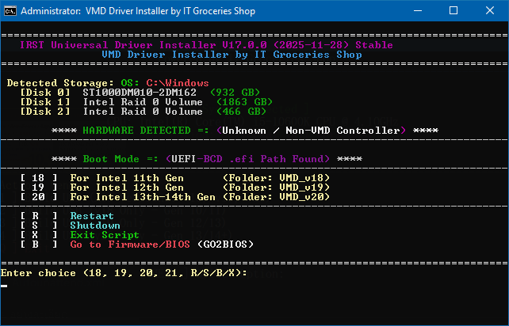
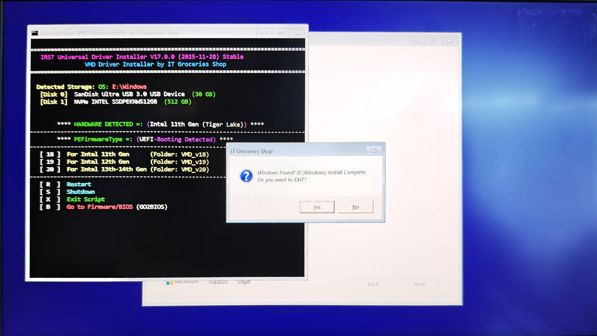

# 🚀 VMD Driver Cloud Installer & USB Builder
### *Powered by IT Groceries Shop*

   

**ทางออกสำหรับปัญหา "มองไม่เห็น SSD" (No Drives Found) ระหว่างลง Windows**
ทำงานอัตโนมัติ 100% | อัจฉริยะ | ไดรเวอร์สดใหม่เสมอ

---


---

## 📸 ภาพรวม (Overview)

โปรเจกต์นี้ถูกสร้างขึ้นเพื่อแก้ปัญหาโลกแตกของช่างคอมพิวเตอร์และผู้ใช้ทั่วไป ที่ลง Windows บนเครื่อง Intel Gen ใหม่ๆ (Gen 11 ขึ้นไป) แล้วมองไม่เห็น Hard Disk หรือ SSD เนื่องจากเทคโนโลยี Intel® VMD

เครื่องมือนี้แบ่งการทำงานเป็น 2 ส่วน คือ **Builder (ตัวสร้าง USB)** และ **Injector (ตัวลงไดรเวอร์)**

### 🛠 ส่วนที่ 1: ระบบสร้าง USB อัจฉริยะ (The Smart Builder)
*ทำงานบน Windows ปกติ เพื่อเตรียมไฟล์ลง USB*

**✨ ฟีเจอร์เด่นในเวอร์ชัน 2.0:**
* **🚀 Hybrid Engine:** เขียนด้วยเทคนิค Hybrid (Batch + PowerShell) ทำให้รันไฟล์ `.cmd` ได้ทันทีโดยไม่ต้องตั้งค่า Execution Policy
* **📡 Cloud & Offline Mode:**
    * **Online:** ดึงไฟล์ `SetupRST.exe` ตัวล่าสุดจาก Server ของ Intel โดยตรง
    * **Offline:** หากไม่มีเน็ต หรือไฟล์ถูกโหลดไว้แล้ว ระบบจะดึงไฟล์จาก Cache มาใช้งานต่อได้ทันที
* **🖥️ Dual-Window UI:** แสดงผลแบบมืออาชีพ
    * **Console:** จอซ้ายสำหรับดู Log การทำงานแบบ Real-time
    * **GUI:** จอขวาสำหรับควบคุมที่ใช้งานง่าย
* **🎮 Hybrid Control:** รองรับการสั่งงานครบทุกรูปแบบ ทั้งการใช้ **เมาส์ (Mouse)** คลิกปุ่ม, หรือกด **คีย์บอร์ด (Numpad 1-4)** เพื่อความรวดเร็ว
* **💾 Smart Drive Selector:**
    * มี Dropdown เลือก Drive ที่จะลงไฟล์ พร้อมบอกพื้นที่ว่าง
    * **Show All Drives:** ติ๊กเลือกเพื่อลงไฟล์ใน External HDD หรือ NVMe Box ได้ (โหมดช่าง)
    * **Manual Copy:** ปุ่มลัดสำหรับก๊อปปี้ไฟล์ลงไดรฟ์ที่เลือกได้ทันที
* **⚡ Auto-Extraction:** ใช้เทคนิคพิเศษในการ "แงะ" ไฟล์ไดรเวอร์ (.inf/.sys) ออกมาจากตัวติดตั้งของ Intel โดยอัตโนมัติ

---

### 🔧 ส่วนที่ 2: ระบบติดตั้งไดรเวอร์ (The Injector - WinPE)
*ทำงานอัตโนมัติเมื่อนำ USB ไปบูตกับเครื่องที่ต้องการลง Windows*

<details><summary>คลิกเพื่อดูภาพตัวอย่างขณะทำงาน</summary>
<table border="0">
  <tr>
    <td width="50%" align="center" valign="top">
      
      <br />
      <em>(Screenshot: The Script running inside Windows Setup)</em>
    </td>
    <td width="50%" align="center" valign="top">
      
      <br />
      <em>(Screenshot: Injection in progress)</em>
    </td>
  </tr>
</table>
</details>

**✨ ขั้นตอนการทำงานอัจฉริยะ:**

1.  **⚡ Auto-Launch (XML):** ทันทีที่บูต USB เข้าหน้า Setup ไฟล์ `Autounattend.xml` จะสั่งให้สคริปต์ `VMD_Installer.cmd` เด้งขึ้นมาทำงานทันที
2.  **💿 Smart Scan:** ระบบจะสแกนหาว่าในเครื่องมี Windows เดิมอยู่หรือไม่ ถ้าเจอจะขึ้นตัวหนังสือสีเขียวแจ้งเตือน
3.  **🧠 CPU Detection:** สคริปต์จะอ่านค่า Hardware ID และบอกรุ่น CPU (Gen 11/12/13+) ให้คุณทราบ เพื่อให้เลือกไดรเวอร์ได้ถูกต้อง
4.  **🔄 Success Verification:** หลังจากลงไดรเวอร์เสร็จ ระบบจะ Rescan อีกครั้ง หากเจอ Partition แล้ว จะมี Popup แจ้งเตือนว่า *"Windows Found!"*
5.  **🆘 Emergency BIOS [B]:** หากสคริปต์ทำงานเสร็จแล้ว ปุ่ม **[ B ] Go to Firmware/BIOS** จะปรากฏขึ้นเพื่อให้คุณรีสตาร์ทเข้า BIOS ได้ทันทีโดยไม่ต้องกด F2 รัวๆ

---

## 🚀 วิธีใช้งาน (How to Use)

### ขั้นตอนที่ 1: เตรียม USB (Builder)
1.  รันผ่าน PowerShell พิมพ์คำสั่งนี้แล้วกด Enter:
    ```powershell
    iex(irm bit.ly/VMDBuilder)
    ```
2.  ในหน้าต่างโปรแกรม:
    * เสียบ USB Flash Drive
    * เลือกไดรฟ์จากช่อง Dropdown ด้านบน
    * กดปุ่ม **[ 1 ] Build USB (All)** เพื่อโหลดและแตกไฟล์ไดรเวอร์
    * (ถ้าเสียบ USB ทีหลัง) ให้กดปุ่ม **[ Copy to Drive > ]**
3.  รอจนกว่าโปรแกรมจะแจ้งว่า **"Complete!"**

### ขั้นตอนที่ 2: นำไปลง Windows (Installer)
1.  นำ USB ที่ได้ไปเสียบกับเครื่องคอมพิวเตอร์เป้าหมาย
2.  บูตเข้า USB เพื่อลง Windows ตามปกติ
3.  **ก่อนเข้าหน้าแบ่งพาร์ติชัน** หน้าต่าง VMD Installer สีดำจะเด้งขึ้นมา
4.  กดตัวเลขตามรุ่น CPU ที่หน้าจอมันแนะนำ (เช่น กด `[4]` สำหรับ Gen 13/14 หรือกด `[1]` เพื่อลงทั้งหมด)
5.  เมื่อเสร็จแล้ว หน้าต่างจะปิดลงเอง และคุณจะมองเห็น SSD พร้อมสำหรับลง Windows!

---

## 📦 ตารางความเข้ากันได้ (Compatibility)

| Intel Generation | VMD Version | โฟลเดอร์ที่เก็บ | สถานะ |
| :--- | :--- | :--- | :--- |
| **Gen 10 - 11** (Ice/Tiger Lake) | **v18.x** | `VMD_v18` | ✅ รองรับ |
| **Gen 12** (Alder Lake) | **v19.x** | `VMD_v19` | ✅ รองรับ |
| **Gen 13 - 14+** (Raptor Lake) | **v20.x** | `VMD_v20` | ✅ รองรับ |

---

## ⚠️ สิ่งที่ต้องมี
* **เครื่องสำหรับทำ USB:** Windows 10/11 และต่ออินเทอร์เน็ต (สำหรับการโหลดครั้งแรก)
* **เครื่องเป้าหมาย:** คอมพิวเตอร์ Intel ที่เปิดโหมด VMD/RST ใน BIOS ไว้

---

## 📜 เครดิต (Credits)
พัฒนาด้วย ❤️ โดย **IT Groceries Shop**
* *Script Logic:* Hybrid PowerShell & Batch
* *Driver Source:* Intel Corporation

---

## 🚀 ต้นฉบับ (Original Source)
<details>
  <summary>คลิกเพื่อดูวิดีโอ YouTube</summary>
<div align="center">
  <a href="https://www.youtube.com/watch?v=Il1kgIVKE3U">
    
  </a>
</div>
</details>
